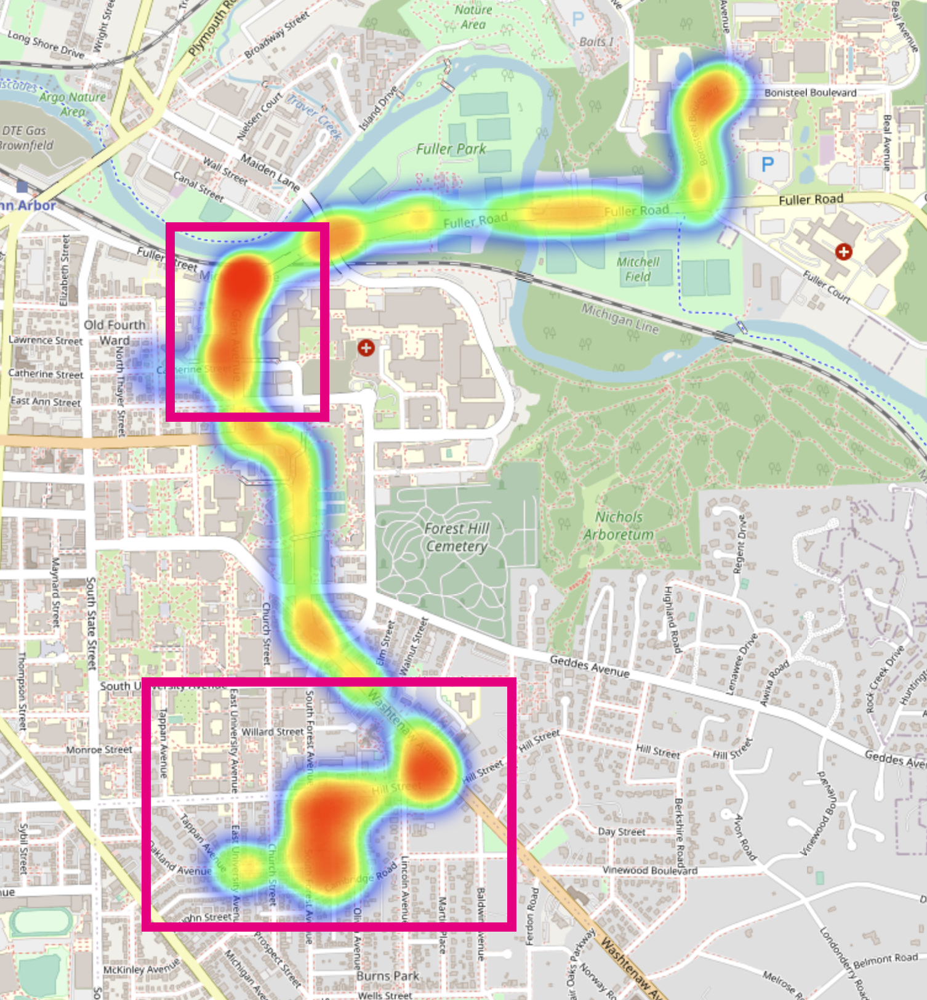
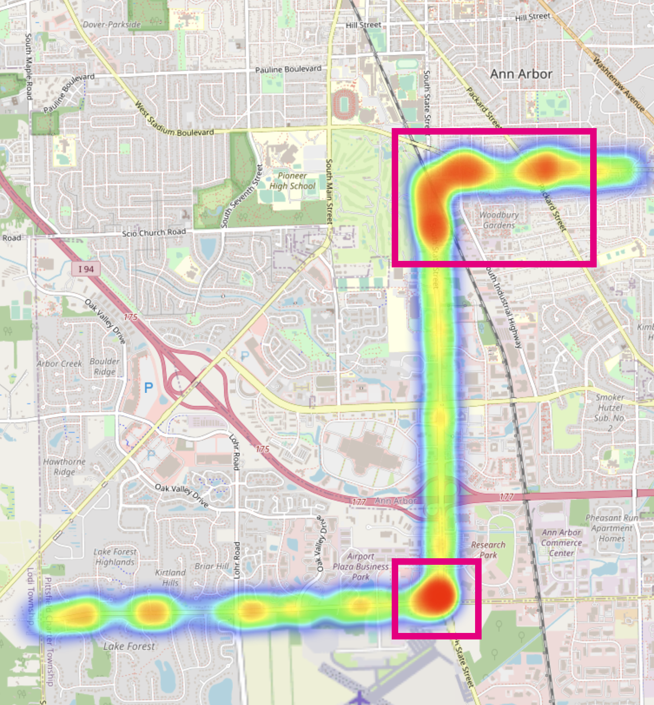
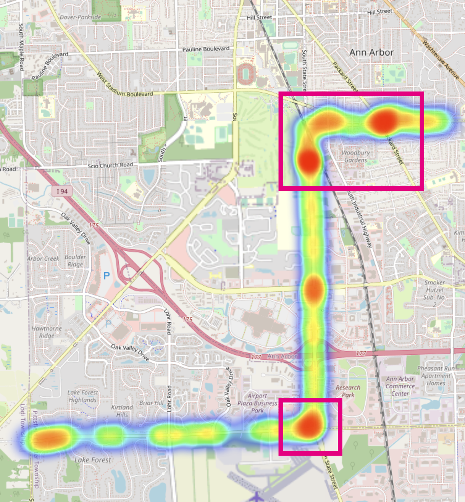
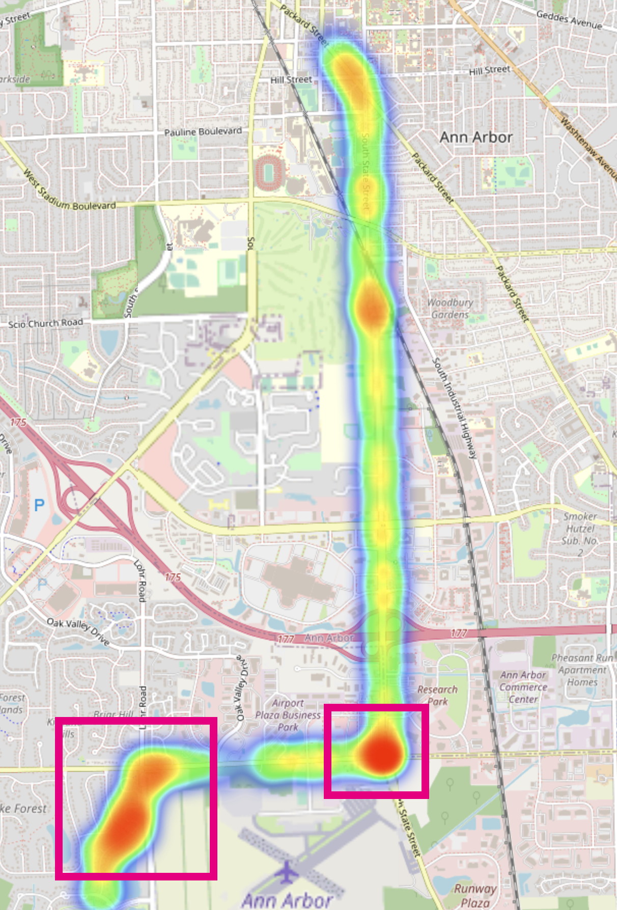

    
	

<b>Figure 1: Case 1, the spatial distribution of the ground truth (left) and predicted VEC (right). </b></left>

    
	

<b>Figure 2: Case 2, the spatial distribution of the ground truth (left) and predicted VEC (right).</b></left>

    
	

<b>Figure 3: Case 3, the spatial distribution of the ground truth (left) and predicted VEC (right).</b></left>

